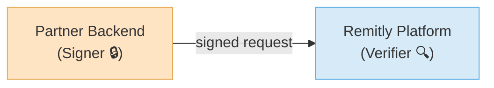
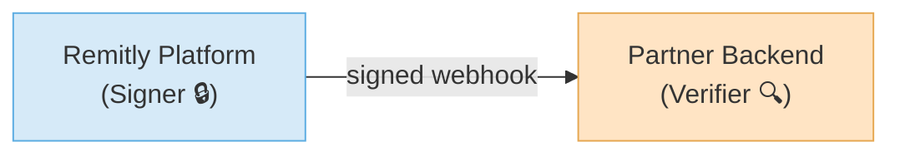
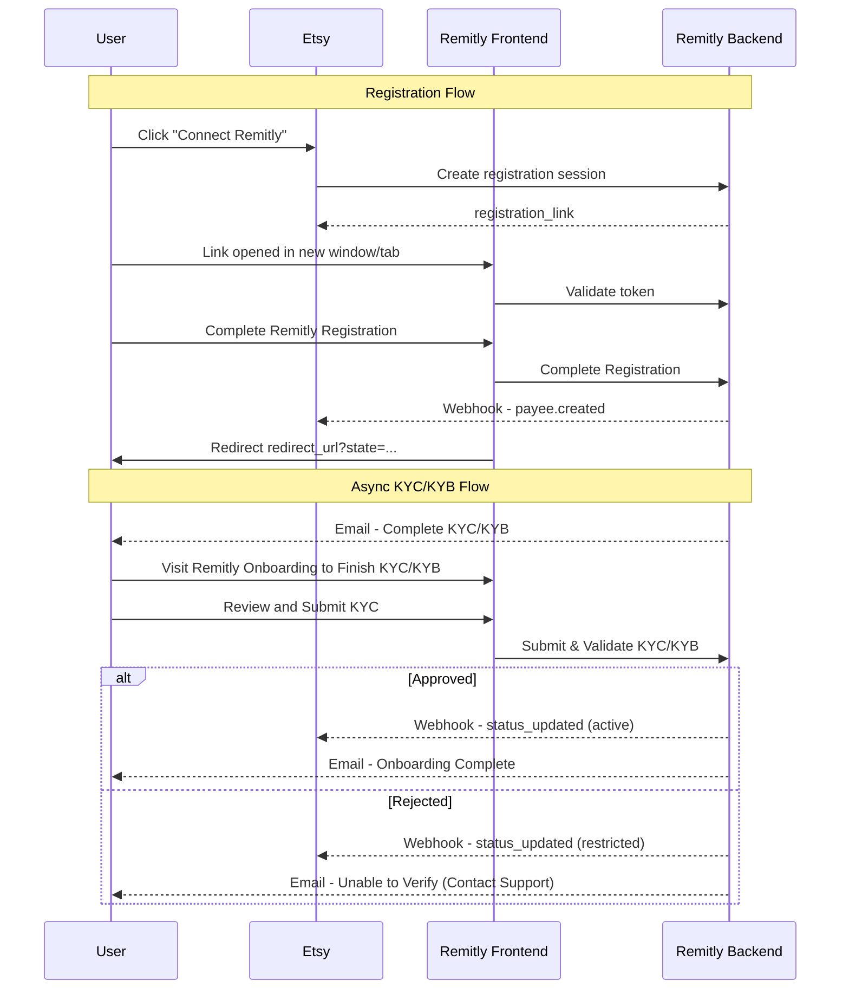
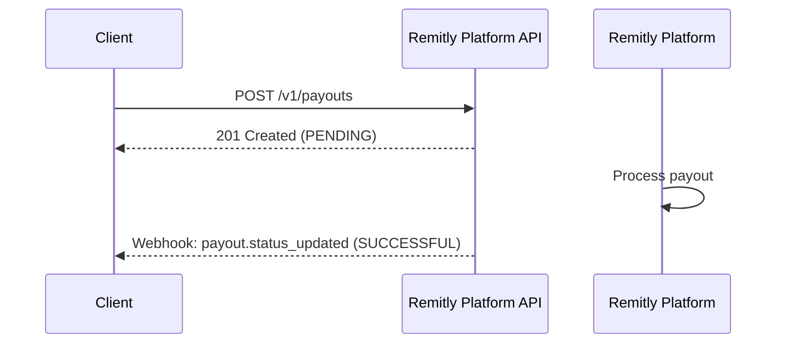
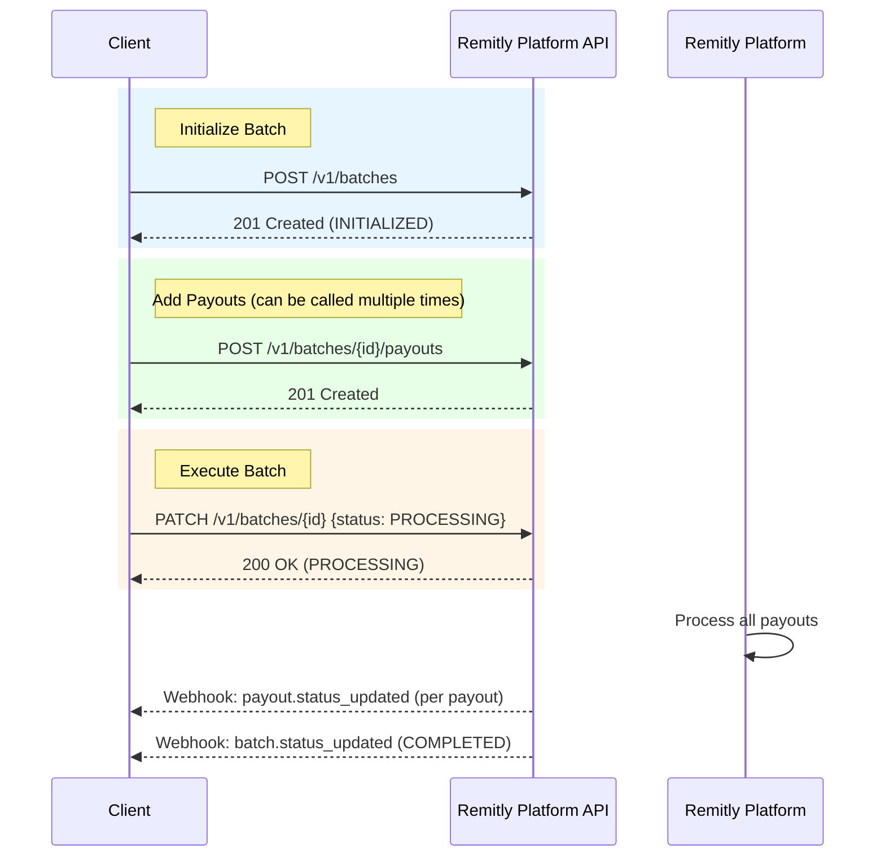

# Getting Started

## Authentication & Security

Remitly Platform uses a two-way authentication model to secure all HTTP communication leveraging a cryptographic signing scheme (ECDSA P-256 with SHA-256). You must sign every request with your private key and include the following headers.

#### When you call Remitly Platform

* You sign each outgoing request to Remitly Platform using your private key  
* Remitly Platform verifies your signatures using your public key



#### When Remitly Platform calls you

* Remitly Platform signs each outgoing request to your service using our private key  
* You verify each incoming request using the Remitly Platform public key 



### Step 1: Get Started

You only need to perform this step once per environment (e.g., sandbox, production).

#### 1\. Generate a key pair

Use OpenSSL to create an ECDSA-P256 public/private key pair:

```shell
openssl ecparam -name prime256v1 -genkey -noout -out <key-id>.private.pem
```

Remitly Platform will issue you a \<key-id\> for each environment (e.g. sandbox, preprod, prod). 

#### 2\. Store the `private key` securely

Use a secure secrets manager (e.g., AWS Secrets Manager or GCP Secret Manager) to store the private key. You’ll use this to sign requests.

#### 3\. Extract the public key

Use openssl to extract the public key from the private key.

```shell
openssl ec -in <key-id>.private.pem -pubout -out <key-id>.public.pem
```

#### 4\. Share the public key

Contact Remitly Platform to securely share your public key. We’ll add it to your partner profile.

### Step 2: Sign Requests to Remitly Platform

Each time your backend sends a request to Remitly Platform, follow these steps:

#### 1\. Generate the date

Create an ISO-8601 UTC timestamp (e.g., `2024-05-12T17:45:00Z`). This becomes your `remitly-date` header. The timestamp is valid for 300 seconds.

#### 2\. Generate the signature

Use your private key, the remitly-date, and the serialized HTTP request body to generate a signature:

```javascript
const signature = sign(privateKey, remitlyDate, payload);
```

Example `sign` function:

```javascript
export const sign = (
  privateKeyPem: string,
  remitlyDate: string,
  payload: string
): string => {
  const privateKey = createPrivateKey(privateKeyPem)
  const hashedPayload = createHash('sha256').update(payload, 'utf8').digest('base64');
  const stringToSign = remitlyDate.trim() + '\n' + hashedPayload
  const sign = createSign('sha256')
  sign.update(stringToSign)
  sign.end()
  const signature = sign.sign({ key: privateKey, dsaEncoding: 'ieee-p1363' })
  return signature.toString('base64')
};
```

#### 3\. Send the request

Include these HTTP headers with your request:

| `Header` | `Type` | `Description` |
| :---- | :---- | :---- |
| `authorization` | `string` | `Scheme and Key ID. Format: REMV1-ECDSA-P256-SHA256 <key-id>` |
| `signature` | `string` | `Message signature.` |
| `remitly-date` | `string` | `ISO-8601 UTC timestamp (valid for 300s).` |

### Step 3: Verify Requests from Remitly Platform

Every time Remitly Platform calls your service, verify that the request is legitimate.

#### 1\. Check required headers

Reject the request if any of these are missing or malformed:

1. `remitly-date` (must be within 300 seconds of current time)  
2. `authorization` (must follow format: REMV1-ECDSA-P256-SHA256 \<key-id\>)  
3. `signature`

#### 2\. Verify `signature`

Use the provided headers, payload, and Remitly Platform’s public key to validate the signature:

```javascript
const verified = verify(publicKey, signature, remitlyDate, payload);

export const verify = (
  publicKeyPem: string,
  signature: string,
  remitlyDate: string,
  payload: string,
): boolean => {
  const publicKey = createPublicKey(publicKeyPem);
  const hashedPayload = createHash("sha256")
    .update(payload, "utf8")
    .digest("base64");
  const stringToSign = remitlyDate.trim() + "\n" + hashedPayload;
  const verify = createVerify("sha256");
  verify.update(stringToSign);
  verify.end();
  const verified = verify.verify(
    { key: publicKey, dsaEncoding: "ieee-p1363" },
    signature,
    "base64",
  );
  return verified;
};
```

If the `verify` function returns `false`, reject the request.

## Versioning

The Remitly Platform API uses URL path versioning. The current version is `v1`.

#### Versioning Policy

- **Major versions** (v1, v2, etc.) may contain breaking changes and are indicated in the URL path  
- **Minor updates** within a version are backward-compatible  
- **Migration guides** will be provided when new major versions are released

All endpoints are prefixed with the version.

## Idempotency

The Remitly Platform API supports idempotency for safely retrying requests without accidentally performing the same operation twice. This is useful when an API call is disrupted in transit and you do not receive a response.

#### How to Use Idempotency

- Include the `Idempotency-Key` header with a unique UUID v4 value on POST and PATCH requests  
- Idempotency keys are stored for **24 hours**  
- If you retry a request with the same idempotency key within 24 hours, the API returns the cached response from the original request  
- After 24 hours, the key expires and a new request with the same key will be treated as a new operation

#### Important Behaviors

- If you submit a request with the same idempotency key but different request parameters, the API returns a `duplicate_request` error  
- Only the response from the first successful request is cached; errors (except for `500` errors) are not cached  
- Idempotency keys are scoped to your account—different accounts can use the same key without conflict

#### Best Practices

- Generate a new UUID v4 for each unique operation  
- Store the idempotency key client-side until you receive a definitive success or failure response  
- Use idempotency keys for all operations that create or modify resources (e.g., creating batches, adding payouts)

## Rate Limits

Usage is limited to **100 requests per second (RPS)** per account. Exceeding this will result in a 429 Too Many Requests response.

# Payee Registration & Onboarding

## Payee Lifecycle Overview

The Payee lifecycle defines the progression of a Payee from registration initiation through onboarding, compliance review, and payout eligibility.



### 1\. Registration Session Created

* A registration session is created via `POST /v1/registration-sessions`.  
* At this stage, a Payee resource does **not** yet exist.  
* A time-limited `registration_link` is returned.  
* No `payee_id` is issued to the partner.

### 2\. Onboarding Initiated

* The payee accesses the `registration_link` in a secure tab or browser window launched by the partner.  
* Payee creates or logs into a Remitly account.  
* Remitly onboarding redirects to the provided partner url and the partner closes the window  
* A Payee resource is created upon successful completion of onboarding.  
* A unique `payee_id` is generated.  
* Initial status is set to: `pending`  
* `A payee.created` webhook is fired.

### 3\. Compliance Submission (KYC / KYB)

* The payee receives an email from Remitly to complete KYC / KYB  
* The payee reviews partner provided KYC / KYB in Remitly web or native application, and provides any other additional Remitly required information and/or documents 

#### Approved

* Upon successful submission, the status transitions to active  
* The payee is eligible to receive funds  
* The payee.status\_updated webhook is fired

#### Rejected / Restricted

* The status transitions to restricted  
* The payee is ineligible to receive funds  
* The payee.status\_updated webhook is fired

### 4\. Ongoing Monitoring

Payee status may change due to the following but not limited to:

* Periodic compliance review  
* Sanctions screening updates  
* Regulatory requirements  
  Suspicious activity

Status may transition from:

* `active` → `restricted`  
* `restricted` → `active` (after remediation)

Each status update will result in a `payee.status_updated` webhook being fired

The partner can retrieve a payee at any time via  `GET /v1/payees/{payeeId}`

## Important Behavioral Rules

* A `payee_id` is issued **only after successful onboarding completion**.  
* `404 Not Found` indicates that no Payee resource exists.  
* Status transitions are communicated via webhooks.  
* Partners should treat `active` as the only payout-eligible state.

### 1\. Create a registration session

Creates a registration session and returns a time-limited, single-use URL that allows a partner payee to initiate and complete onboarding.

#### Notes

* The `registration_link` contains a cryptographically random, single use token with a maximum lifetime of 15 minutes  
* The token is:  
  * Bound to the provided `external_user_id`  
  * Invalidated upon first successful onboarding completion  
  * Automatically expired after 15 minutes if unused  
* After successful completion, the token becomes permanently invalid and cannot be reused  
* If the token expires or onboarding is completed, the partner must generate a new registration session to restart the flow  
* The `registration_link` must be opened in a new tab or browser window (iframe embedding is not supported).  
* Remitly will return the state value unchanged as a query parameter to the provided `redirect_url` upon successful completion.  
* The locale determines the language of the registration page. If not provided or supported, it defaults to en.

```
POST /v1/registration-sessions
```

**Body**

* **external\_user\_id** `string` — **REQUIRED**   
  * Unique identifier of the payee on the partner’s platform.  
* **state** `string` — **REQUIRED**   
  * Partner generated opaque correlation nonce.   
  * Used by the partner to correlate the registration completion redirect with the original session and prevent CSRF/mix-up attacks  
* **redirect\_url** `string` — **REQUIRED**   
  * URL that the payee will be redirected to upon completion of registration.  
* **locale** `string` — **OPTIONAL**  
  * IETF BCP 47 language tag  
* **payee** `object` — **REQUIRED**   
  * **type** `string` — **REQUIRED**   
    * Individual or Business  
  * **individual** `object` — **REQUIRED if type is individual**  
    * Individual entity  
  * **business** `object` — **REQUIRED if type is business**   
    * Business entity  
* 

**Example Request**

```json
{
  "external_user_id": "externalUser123",
  "state": "",
  "redirect_url": "",
  "locale": "en-US",
  "payee": {
    "type": "individual",
    "individual": {
      "personal_information": {
        "first_name": "John",
        "middle_name": "Joe",
        "last_name": "Smith",
        "second_last_name": "Doe",
        "date_of_birth": "1980-01-01"
      },
      "address": {
        "line_1": "123 Test Street",
        "line_2": "Apt 300",
        "postal_code": "00000",
        "city": "Seattle",
        "subdivision": "WA",
        "country": "USA"
      },
      "phone": "+12225550123",
      "email": "john.smith@example.com"
    }
  }
}
```

**Example Response (201 Created)**

```json
{
  "registration_link": "https://www.remitly.com/partners/registration?lang=en-US&token=324f6a5...",
  "expires_at": "2026-02-20T18:00:00Z"
}
```

### 2\. Retrieve a payee by External User ID

Retrieves the Payee associated with the specified `external_user_id`.

```
GET /v1/payees?external_user_id={external_user_id}
```

**Query Parameters**

* **external\_user\_id** `string` — **REQUIRED**   
  * Unique identifier of the payee on the partner’s platform.

**Responses**

* 200 OK  
* 404 Not Found \- The specified payee given a `external_user_id` does not exist

**Example Response (200)**

```json
{
  "payee_id": "payee123",
  "external_user_id": "externalUser123",
  "status": "pending",
  "type": "individual",
  "individual": {
    "personal_information": {
      "first_name": "John",
      "middle_name": "Joe",
      "last_name": "Smith",
      "second_last_name": "Doe",
      "date_of_birth": "1980-01-01"
    },
    "address": {
      "line_1": "123 Test Street",
      "line_2": "Apt 300",
      "postal_code": "00000",
      "city": "Seattle",
      "subdivision": "WA",
      "country": "USA"
    },
    "phone": "+12225550123",
    "email": "john.smith@example.com"
  }
}
```

### 3\. Retrieve a payee

Retrieves the Payee resource identified by the specified `payee_id`.

```
GET /v1/payees/{payeeId}
```

**Path Parameters**

* **payee\_id** `string` — **REQUIRED**   
  * Unique identifier for the payee.

**Responses**

* 200 OK  
* 404 Not Found \- The specified `payee_id` does not exist

**Example Response (200)**

```json
{
  "payee_id": "payee123",
  "external_user_id": "externalUser123",
  "status": "pending",
  "type": "individual",
  "individual": {
    "personal_information": {
      "first_name": "John",
      "middle_name": "Joe",
      "last_name": "Smith",
      "second_last_name": "Doe",
      "date_of_birth": "1980-01-01"
    },
    "address": {
      "line_1": "123 Test Street",
      "line_2": "Apt 300",
      "postal_code": "00000",
      "city": "Seattle",
      "subdivision": "WA",
      "country": "USA"
    },
    "phone": "+12225550123",
    "email": "john.smith@example.com"
  }
}
```

### 3.1 Webhook payee.created

Fired when a payee is created.

**Example Payload**

```json
{
  "id": "evt_101",
  "type": "payee.created",
  "timestamp": "2024-10-01T14:30:00Z",
  "data": {
    "payee_id": "payee123",
    "external_user_id": "externalUser123",
    "status": "active",
    "individual": {
      "personal_information": {
        "first_name": "John",
        "middle_name": "Joe",
        "last_name": "Smith",
        "second_last_name": "Doe",
        "date_of_birth": "1980-01-01"
      },
      "address": {
        "line_1": "123 Test Street",
        "line_2": "Apt 300",
        "postal_code": "00000",
        "city": "Seattle",
        "subdivision": "WA",
        "country": "USA"
      },
      "phone": "+12225550123",
      "email": "john.smith@example.com"
    }
  }
}
```

### 3.2 Webhook payee.status\_updated

Fired when an individual payee status changes.

**Example Payload**

```json
{
  "id": "evt_101",
  "type": "payee.status_updated",
  "timestamp": "2024-10-01T14:30:00Z",
  "data": {
    "payee_id": "payee123",
    "external_user_id": "externalUser123",
    "status": "active",
    "individual": {
      "personal_information": {
        "first_name": "John",
        "middle_name": "Joe",
        "last_name": "Smith",
        "second_last_name": "Doe",
        "date_of_birth": "1980-01-01"
      },
      "address": {
        "line_1": "123 Test Street",
        "line_2": "Apt 300",
        "postal_code": "00000",
        "city": "Seattle",
        "subdivision": "WA",
        "country": "USA"
      },
      "phone": "+12225550123",
      "email": "john.smith@example.com"
    }
  }
}
```

## Entities

### 1\. Payee

A Payee represents a partner’s user within Remitly’s platform and is the canonical entity used for onboarding, KYC, and payout eligibility

| `Attribute` | `Type` | `Description` | `Example` |
| :---- | :---- | :---- | :---- |
| `payee_id` | `string` | `Unique identifier for payee` | `xyz987` |
| `external_user_id` | `string` | `Unique identifier of the payee on the partner’s platform` | `abc123` |
| `status` | `string` | `The status of the payee` | `pending` |
| `type` | `string` | `The type of the payee` | `individual` |
| `individual` | `object` | `An individual object` |  |
| `business` | `object` | `A business object` |  |

### 1.1 Payee Status

Status represents the current lifecycle stage of the Payee and whether they are eligible to receive payouts

| `Attribute` | `Type` | `Description` |
| :---- | :---- | :---- |
| `pending` | `string` | `The payee has not completed registration, onboarding, or KYC/B requirements` |
| `active` | `string` | `The payee is able to receive funds` |
| `restricted` | `string` | `The payee is in a state in which the account cannot receive funds` |

##### 

##### 1\. Individual

A Payee represents a partner’s user within Remitly’s platform and is the canonical entity used for onboarding, KYC, and payout eligibility

| `Attribute` | `Type` | `Description` | `Required` |
| :---- | :---- | :---- | :---- |
| `personal_information` | `object` | `Personal Information Entity` | `Y` |
| `address` | `object` | `Address Entity` | `Y` |
| `phone` | `string` | `E.164-formatted phone number.` | `Y` |
| `email` | `string` | `Email address` |  |

##### Personal Information

| `Attribute` | `Type` | `Description` | `Required` |
| :---- | :---- | :---- | :---- |
| `first_name` | `string` | `First Name` | `Y` |
| `middle_name` | `string` | `Middle Name` |  |
| `last_name` | `string` | `Last Name` | `Y` |
| `second_last_name` | `string` | `Second Last Name` |  |
| `date_of_birth` | `string` | `ISO-8601 date string representing date of birth`  | `Y` |

##### `Address`

| `Attribute` | `Type` | `Description` | `Required` |
| :---- | :---- | :---- | :---- |
| `line_1` | `string` | `Address line 1` | `Y` |
| `line_2` | `string` | `Address line 2` |  |
| `postal_code` | `string` | `Postal code` |  |
| `city` | `string` | `City` | `Y` |
| `subdivision` | `string` | `Subdivision` |  |
| `country` | `string` | `ISO-3166-1 alpha-3 country code` | `Y` |

##### `Business`

| `Attribute` | `Type` | `Description` | `Required` |
| :---- | :---- | :---- | :---- |
| `name` | `string` | `Legal name of the organization.` |  |
| `trade_name` | `string` | `Doing Business As (DBA) name.` |  |
| `address` | `object` | `Legal/Physical address (see Address entity).` |  |
| `country_of_registration` | `string` | `ISO-3166-1 alpha-3 country code.` |  |
| `org_category` | `string` | `High-level business category.` |  |
| `org_category_other` | `string` | `Custom category if org_category is "other".` |  |
| `org_industry_classification` | `object` | `Industry classification (see OrgIndustryClassification).` |  |
| `entity_type` | `string` | `Legal entity type (e.g., corporation, partnership).` |  |
| `org_description` | `object` | `Business description details (see OrgDescription).` |  |
| `partners` | `array of objects` | `List of key personnel/partners (see Partner entity).` |  |
| `no_of_employees_range` | `string` | `Range of total employees (e.g., 1-10, 11-50).` |  |
| `org_website_url` | `string` | `Organization's official website.` |  |
| `employee_description` | `string` | `Description of employees.` |  |
| `customer_description` | `string` | `Description of the customer base.` |  |
| `org_identifier` | `object` | `Legal identification numbers (see OrgIdentifier).` |  |

##### `Org Industrial Classification`

| `Attribute` | `Type` | `Description` | `Required` |
| :---- | :---- | :---- | :---- |
| `type` | `string` | `Classification standard being used.` |  |
| `value` | `string` | `The classification code.` |  |
| `label` | `string` | `Human-readable label for the code.` |  |

##### `Org Description`

| `Attribute` | `Type` | `Description` | `Required` |
| :---- | :---- | :---- | :---- |
| `products_services_description` | `string` | `Detailed description of products/services offered.` |  |
| `organization_jurisdictions` | `string` | `Jurisdictions where the organization operates.` |  |
| `customer_description_other_value` | `string` | `Free-text description of customers if needed.` |  |

##### `Partner`

| `Attribute` | `Type` | `Description` | `Required` |
| :---- | :---- | :---- | :---- |
| `title` | `string` | `Partner's title (e.g., CEO, Director).` |  |
| `title_list` | `array of string` | `List of available titles for selection.` |  |
| `title_other_value` | `string` | `Custom title if not in list.` |  |
| `countries_of_citizenship` | `array of string` | `ISO-3166-1 alpha-3 country codes.` |  |
| `personal_information` | `object` | `Partner's personal information (see Personal Information entity).` |  |
| `address` | `object` | `Partner's address (see Address entity).` |  |
| `phone_number` | `string` | `E.164-formatted phone number.` |  |
| `tax_id_last_four` | `string` | `Last four digits of tax ID.` |  |
| `ownership_percentage` | `number` | `Percentage of company ownership.` |  |
| `ekyc_status` | `string` | `Status of the electronic KYC check.` |  |
| `watchlist_status` | `string` | `Status of the watchlist check.` |  |
| `type` | `array of string` | `Partner roles/types.` |  |

##### `Org Identifier`

| `Attribute` | `Type` | `Description` | `Required` |
| :---- | :---- | :---- | :---- |
| type | string | Type of identifier (e.g., EIN, VAT, LEI). |  |
| value | string | The actual identifier number. |  |
| country | string | ISO-3166-1 alpha-3 country code of issue. |  |
| jurisdiction | object | Further jurisdictional details if needed. |  |
| is\_primary | boolean | Indicates if this is the main identifier. |  |

##### 

# Payouts

## Payout Lifecycle

### Standalone Payout



### Batch Payouts



## Payout APIs

### 1\. Create a payout

```
POST /v1/payouts
```

**Headers**

* **Idempotency-Key** `string` — **REQUIRED**  
  * A unique UUID v4 for the request.

**Attributes**

* **external\_payout\_id** `string` — **REQUIRED**  
  * Your internal reference ID for this payout.  
* **payee\_id** `string` — **REQUIRED**  
  * The Remitly internal ID for the recipient.  
* **amount** `string` — **REQUIRED**  
  * The transfer amount in decimal base currency units (e.g., `"10.00"` \= $10.00 USD).  
* **currency** `string` — **REQUIRED**  
  * ISO currency code (must be USD).  
* **metadata** `dictionary` — **OPTIONAL**  
  * Custom key-value pairs (max 10 fields, 255 chars/value).

**Example Request**

```json
{
  "external_payout_id": "external_payout_123",
  "payee_id": "payee123",
  "amount": "250.00",
  "currency": "USD",
  "metadata": { "invoice_id": "INV-2026-001" }
}
```

**Example Response (201 Created)**

```json
{
  "id": "pay_standalone_001",
  "external_payout_id": "external_payout_123",
  "payee_id": "payee123",
  "status": "PENDING",
  "amount": "250.00",
  "currency": "USD",
  "metadata": { "invoice_id": "INV-2026-001" },
  "created_at": "2026-02-23T10:00:00Z"
}
```

### 2\. Get payout details

```
GET /v1/payouts/{payout_id}
```

**Example Response (200 OK)**

```json
{
  "id": "pay_alpha",
  "external_payout_id": "external_payout_123",
  "payee_id": "payee123",
  "status": "SUCCESSFUL",
  "amount": "100.00",
  "currency": "USD",
  "metadata": { "bonus_id": "B-99" },
  "created_at": "2024-10-01T12:05:00Z"
}
```

## Batch APIs

### 3\. Create a batch

```
POST /v1/batches
```

**Headers**

* **Idempotency-Key** `string` — **REQUIRED**  
  * A unique UUID v4 for the request.

**Attributes**

* **external\_batch\_id** `string` — **REQUIRED**  
  * Unique identifier for reconciliation.  
* **total\_amount** `string` — **REQUIRED**  
  * The expected total for the batch in decimal base currency units (e.g., `"10.00"` \= $10.00 USD).  
* **currency** `string` — **REQUIRED**  
  * Must be USD.  
* **metadata** `dictionary` — **OPTIONAL**  
  * Custom tags for internal reference.

**Example Request**

```json
{
  "external_batch_id": "external_batch_123",
  "total_amount": "50000.00",
  "currency": "USD",
  "metadata": { "region": "North_America", "dept": "Engineering" }
}
```

**Example Response (201 Created)**

```json
{
  "id": "bat_9921",
  "external_batch_id": "external_batch_123",
  "status": "INITIALIZED",
  "total_amount": "50000.00",
  "currency": "USD",
  "metadata": { "region": "North_America", "dept": "Engineering" },
  "created_at": "2024-10-01T12:00:00Z"
}
```

### 4\. Add payouts to a batch

```
POST /v1/batches/{batch_id}/payouts
```

**Headers**

* **Idempotency-Key** `string` — **REQUIRED**  
  * A unique UUID v4 for the request.

**Attributes**

* **payouts** `object` — **REQUIRED**  
  * Container for payout items.  
* **payout.items** `array` — **REQUIRED**  
  * List of payout objects.  
* **payout.items.external\_payout\_id** `string` — **REQUIRED**  
  * Your internal payout reference ID.  
* **payout.items.payee\_id** `string` — **REQUIRED**  
  * The Remitly internal ID for the recipient.  
* **payout.items.amount** `string` — **REQUIRED**  
  * The transfer amount in decimal base currency units (e.g., `"10.00"` \= $10.00 USD).  
* **payout.items.currency** `string` — **REQUIRED**  
  * Must be USD.  
* **payout.items.metadata** `dictionary` — **OPTIONAL**  
  * Payout-specific custom data.

**Note:** A single request can contain up to 500 payouts. For larger batches, make multiple requests.

**Example Request**

```json
{
  "payouts": {
    "items": [
      {
        "external_payout_id": "external_payout_123",
        "payee_id": "payee123",
        "amount": "100.00",
        "currency": "USD",
        "metadata": { "bonus_id": "B-99" }
      }
    ]
  }
}
```

**Example Response (202 Accepted)**

```json
{
  "payouts": {
    "items": [
      {
        "id": "pay_alpha",
        "external_payout_id": "external_payout_123",
        "payee_id": "payee123",
        "status": "PENDING",
        "amount": "100.00",
        "currency": "USD",
        "metadata": { "bonus_id": "B-99" },
        "created_at": "2024-10-01T12:05:00Z"
      }
    ]
  }
}
```

### 5\. Update batch status (Execute/Cancel)

```
PATCH /v1/batches/{batch_id}
```

**Headers**

* **Idempotency-Key** `string` — **REQUIRED**  
  * A unique UUID v4 for the request.

**Attributes**

* **status** `string` — **REQUIRED**  
  * Target state. Set to `PROCESSING` to start execution or `CANCEL_REQUESTED` to halt the batch.

**Valid Status Transitions:**

| `Target Status` | `Allowed When Current Status Is` | `Description` |
| :---- | :---- | :---- |
| `PROCESSING` | `INITIALIZED` | `Start executing the batch. All payouts will begin processing.` |
| `CANCEL_REQUESTED` | `INITIALIZED` | `Cancel before execution. All payouts will be cancelled.` |
| `CANCEL_REQUESTED` | `PROCESSING` | `Cancel during execution. Best effort to cancel remaining payouts.` |

**Cancellation Behavior:**

- If batch processing has **not yet started** (status is `INITIALIZED`): All payouts in the batch will be cancelled.  
- If batch processing has **already started** (status is `PROCESSING`): Payouts that have already been processed will remain in their current state. We will make a best effort to cancel payouts that have not yet been processed.

**Example Request**

```json
{
  "status": "PROCESSING"
}
```

**Example Response (200 OK)**

```json
{
  "id": "bat_9921",
  "status": "PROCESSING"
}
```

### 6\. Get batch summary

```
GET /v1/batches/{batch_id}
```

**Example Response (200 OK)**

```json
{
  "id": "bat_9921",
  "external_batch_id": "external_batch_123",
  "status": "COMPLETED",
  "total_amount": "50000.00",
  "total_transferred_amount": "50000.00",
  "currency": "USD",
  "metadata": { "region": "North_America" },
  "created_at": "2024-10-01T12:00:00Z"
}
```

### 7\. List payouts in a batch

```
GET /v1/batches/{batch_id}/payouts
```

**Query Parameters**

* **limit** `integer` — **OPTIONAL**  
  * Maximum number of results per page. Default: 100\. Min: 1, Max: 1000\.  
* **next\_cursor** `string` — **OPTIONAL**  
  * Cursor for pagination. Use the value from the previous response's `next_cursor` field to retrieve the next page.

**Example Response (200 OK)**

```json
{
  "payouts": {
    "items": [
      {
        "id": "pay_alpha",
        "external_payout_id": "external_payout_123",
        "payee_id": "payee123",
        "status": "SUCCESSFUL",
        "amount": "100.00",
        "currency": "USD",
        "metadata": { "bonus_id": "B-99" },
        "created_at": "2024-10-01T12:05:00Z"
      }
    ]
  },
  "next_cursor": "pay_beta"
}
```

## Report APIs

Currently, only **settlement** reports are supported.

### 8\. Create report

Trigger a background job to generate a settlement report.

```
POST /v1/reports
```

**Headers**

* **Idempotency-Key** `string` — **REQUIRED**  
  * A unique UUID v4 for the request.

**Attributes**

* **type** `string` — **REQUIRED**  
  * Type of report to generate. Currently only `"settlement"` is supported.  
* **start\_time** `string` — **REQUIRED**  
  * Start time for the report period (ISO-8601 UTC timestamp).  
* **end\_time** `string` — **REQUIRED**  
  * End time for the report period (ISO-8601 UTC timestamp).  
* **format** `string` — **REQUIRED**  
  * Output format for the report (e.g., "csv", "json").

**Example Request**

```json
{
  "type": "settlement",
  "start_time": "2024-10-01T00:00:00Z",
  "end_time": "2024-10-02T00:00:00Z",
  "format": "csv"
}
```

**Example Response (201 Created)**

```json
{
  "report_id": "rpt_888999abc",
  "status": "PROCESSING",
  "created_at": "2024-10-02T08:00:00Z"
}
```

### 9\. Check report status

Poll this endpoint to check if the report is ready for download.

```
GET /v1/reports/{report_id}
```

**Example Response (200 OK)**

```json
{
  "report_id": "rpt_888999abc",
  "status": "COMPLETED",
  "download_url": "https://access.remitly.com/v1/reports/rpt_888.csv"
}
```

## Webhooks

Remitly Platform sends webhook notifications to your registered endpoint when significant events occur. Webhooks are signed using the  ECDSA P-256 with SHA-256 scheme described in the Authentication & Security section. You must verify the signature of incoming webhooks before processing them.

To register your webhook endpoint, contact Remitly Platform with your HTTPS endpoint URL. Your endpoint must:

- Accept POST requests with JSON payloads  
- Return a 2xx status code within 10 seconds to acknowledge receipt  
- Verify the request signature using Remitly Platform's public key

### payout.status\_updated

Fired when an individual payout changes state.

**Example Payload**

```json
{
  "id": "evt_101",
  "type": "payout.status_updated",
  "timestamp": "2024-10-01T14:30:00Z",
  "data": {
    "id": "pay_alpha",
    "external_payout_id": "external_payout_123",
    "status": "SUCCESSFUL",
    "amount": "100.00",
    "currency": "USD",
    "metadata": { "bonus_id": "B-99" },
    "created_at": "2024-10-01T12:05:00Z"
  }
}
```

### batch.status\_updated

Fired when the batch changes state.

**Example Payload**

```json
{
  "id": "evt_202",
  "type": "batch.status_updated",
  "timestamp": "2024-10-01T16:00:00Z",
  "data": {
    "id": "bat_9921",
    "status": "COMPLETED",
    "total_transferred_amount": "50000.00",
    "currency": "USD",
    "created_at": "2024-10-01T12:00:00Z"
  }
}
```

## Reference

### Entities

#### Batch

A Batch is a high-level container used to group and manage up to 10,000 payout items.

| `Attribute` | `Type` | `Description` | `Example` |
| :---- | :---- | :---- | :---- |
| `id` | `string` | `Unique identifier for the batch.` | `bat_55219` |
| `external_batch_id` | `string` | `Your unique identifier for the batch, used for reconciliation.` | `external_batch_123` |
| `status` | `string` | `The current state: INITIALIZED, PROCESSING, CANCEL_REQUESTED, CANCELLED, COMPLETED, COMPLETED_WITH_ERRORS, FAILED.` | `PROCESSING` |
| `total_amount` | `string` | `The target sum of all payouts in decimal base currency units (e.g., "10.00" = $10.00 USD).` | `10500.25` |
| `total_transferred_amount` | `string` | `The sum of payouts that have reached a SUCCESSFUL terminal state, in decimal base currency units.` | `8000.00` |
| `currency` | `string` | `ISO currency code (currently USD).` | `USD` |
| `metadata` | `dictionary` | `Custom key-value pairs associated with the batch.` | `{"dept": "finance"}` |
| `created_at` | `string` | `Timestamp when the batch was created (ISO-8601 UTC).` | `2024-10-01T12:00:00Z` |

#### Payout

A Payout represents an individual transfer of funds to a specific recipient.

| `Attribute` | `Type` | `Description` | `Example` |
| :---- | :---- | :---- | :---- |
| `id` | `string` | `Unique Remitly identifier for the payout.` | `pay_99212` |
| `external_payout_id` | `string` | `The unique identifier you assigned to this payout.` | `external_payout_123` |
| `payee_id` | `string` | `The internal Remitly ID for the recipient.` | `payee123` |
| `status` | `string` | `Current state: PENDING, VALIDATING, SUBMITTED, SUCCESSFUL, FAILED, CANCELLED.` | `SUCCESSFUL` |
| `amount` | `string` | `The amount to be transferred in decimal base currency units (e.g., "10.00" = $10.00 USD).` | `1200.00` |
| `currency` | `string` | `ISO currency code (currently USD).` | `USD` |
| `metadata` | `dictionary` | `Custom key-value pairs for this specific payout.` | `{"bonus_id": "B-99"}` |
| `error` | `object` | `Contains error details if the payout status is FAILED. Includes code (machine-readable error code) and message (human-readable description).` | `{"code": "invalid_routing", "message": "The routing number provided is invalid."}` |
| `created_at` | `string` | `Timestamp when the payout was created (ISO-8601 UTC).` | `2024-10-01T12:00:00Z` |

### Status Lifecycle

#### Batch States

| `State` | `Description` | `Terminal` |
| :---- | :---- | :---: |
| `INITIALIZED` | `Batch has been created and is open for adding payouts.` | `No` |
| `PROCESSING` | `Batch execution has started; payouts are being processed.` | `No` |
| `CANCEL_REQUESTED` | `A cancellation request has been submitted; processing is stopping.` | `No` |
| `CANCELLED` | `Batch has been successfully cancelled. No further payouts will be processed.` | `Yes` |
| `COMPLETED` | `All payouts in the batch have been processed successfully.` | `Yes` |
| `COMPLETED_WITH_ERRORS` | `Batch processing finished, but one or more payouts failed.` | `Yes` |
| `FAILED` | `Batch processing failed entirely due to a system error.` | `Yes` |

**Cancellation Behavior:**

- **From `INITIALIZED`:** All payouts in the batch will be cancelled.  
- **From `PROCESSING`:** Payouts already processed remain in their current state. Best effort will be made to cancel payouts not yet processed.

##### Batch State Transitions

```
INITIALIZED → PROCESSING (execute batch)
INITIALIZED → CANCEL_REQUESTED (cancel batch — all payouts cancelled)
PROCESSING → CANCEL_REQUESTED (cancel batch — best effort cancellation)
PROCESSING → COMPLETED | COMPLETED_WITH_ERRORS | FAILED
CANCEL_REQUESTED → CANCELLED
```

#### Payout States

| `State` | `Description` | `Terminal` |
| :---- | :---- | :---: |
| `PENDING` | `Payout has been created (standalone or in a batch) but processing has not started.` | `No` |
| `VALIDATING` | `Payout is being validated (recipient details, routing, etc.).` | `No` |
| `SUBMITTED` | `Payout has been submitted to the payment network.` | `No` |
| `SUCCESSFUL` | `Payout has been successfully delivered to the recipient.` | `Yes` |
| `FAILED` | `Payout failed due to an error (see error field for details).` | `Yes` |
| `CANCELLED` | `Payout was cancelled before completion (e.g., batch was cancelled).` | `Yes` |

**Payout State Transitions:**

```
PENDING → VALIDATING (batch execution starts or standalone payout processing begins)
PENDING → CANCELLED (batch cancelled before execution)
VALIDATING → SUBMITTED | FAILED
VALIDATING → CANCELLED (batch cancelled during validation)
SUBMITTED → SUCCESSFUL | FAILED
```

### Metadata

Some Remitly Platform API endpoints accept a `metadata` object that stores additional information about a resource with custom fields.

**Supported Field Types:**

- String  
- Number  
- Boolean

**Note:** Arrays and nested objects are not supported within metadata.

**Constraints:**

- You can provide up to **10 metadata fields** per resource  
- The value of each field must not exceed **255 characters** in length

Metadata is useful for storing custom reference IDs, tags, or any additional context needed for reporting and reconciliation purposes.

### Errors

#### Error Object

| `Attribute` | `Type` | `Description` | `Example` |
| :---- | :---- | :---- | :---- |
| `error_type` | `string` | `Category: invalid_request_error, authentication_error, idempotency_error, rate_limit_error, or api_error.` | `invalid_request_error` |
| `error_code` | `string` | `Machine-readable code identifying the specific error.` | `parameter_missing` |
| `message` | `string` | `Human-readable description.` | `The total_amount field is required.` |

#### Common Error Codes

| `Code` | `Description` |
| :---- | :---- |
| `invalid_request` | `The request body is malformed or missing required fields.` |
| `invalid_parameter` | `A parameter value is invalid or out of range.` |
| `authentication_failed` | `The request signature is invalid or expired.` |
| `authorization_failed` | `The auth context does not have permission for this operation.` |
| `resource_not_found` | `The requested resource (batch, payout, report) does not exist.` |
| `duplicate_request` | `A request with this idempotency key has already been processed.` |
| `rate_limit_exceeded` | `Too many requests. Retry after the indicated time.` |
| `batch_not_editable` | `The batch is no longer in INITIALIZED state and cannot be modified.` |
| `insufficient_funds` | `The account does not have sufficient balance for this operation.` |
| `invalid_routing` | `The recipient's routing number is invalid.` |
| `invalid_account` | `The recipient's account number is invalid.` |
| `recipient_rejected` | `The recipient's bank rejected the transfer.` |
| `internal_error` | `An unexpected error occurred. Contact support if this persists.` |
