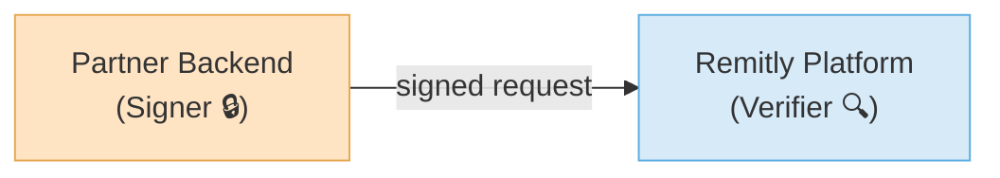
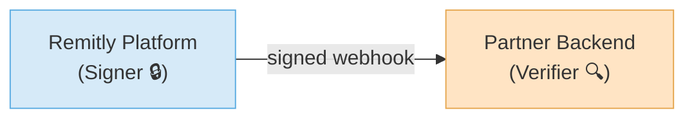

# Authentication & Security

Remitly Platform uses a two-way authentication model to secure all HTTP communication leveraging a cryptographic signing scheme (ECDSA P-256 with SHA-256). You must sign every request with your private key and include the following headers.

## When you call Remitly Platform

* You sign each outgoing request to Remitly Platform using your private key  
* Remitly Platform verifies your signatures using your public key



## When Remitly Platform calls you

* Remitly Platform signs each outgoing request to your service using our private key  
* You verify each incoming request using the Remitly Platform public key 



## Step 1: Get Started

You only need to perform this step once per environment (e.g., sandbox, production).

### 1. Generate a key pair

Use OpenSSL to create an ECDSA-P256 public/private key pair:

```shell
openssl ecparam -name prime256v1 -genkey -noout -out <key-id>.private.pem
```

Remitly Platform will issue you a `<key-id>` for each environment (e.g. sandbox, preprod, prod). 

### 2. Store the `private key` securely

Use a secure secrets manager (e.g., AWS Secrets Manager or GCP Secret Manager) to store the private key. You'll use this to sign requests.

### 3. Extract the public key

Use openssl to extract the public key from the private key.

```shell
openssl ec -in <key-id>.private.pem -pubout -out <key-id>.public.pem
```

### 4. Share the public key

Contact Remitly Platform to securely share your public key. We'll add it to your partner profile.

## Step 2: Sign Requests to Remitly Platform

Each time your backend sends a request to Remitly Platform, follow these steps:

### 1. Generate the date

Create an ISO-8601 UTC timestamp (e.g., `2024-05-12T17:45:00Z`). This becomes your `remitly-date` header. The timestamp is valid for 300 seconds.

### 2. Generate the signature

Use your private key, the remitly-date, and the serialized HTTP request body to generate a signature:

```javascript
const signature = sign(privateKey, remitlyDate, payload);
```

Example `sign` function:

```javascript
export const sign = (
  privateKeyPem: string,
  remitlyDate: string,
  payload: string
): string => {
  const privateKey = createPrivateKey(privateKeyPem)
  const hashedPayload = createHash('sha256').update(payload, 'utf8').digest('base64');
  const stringToSign = remitlyDate.trim() + '\n' + hashedPayload
  const sign = createSign('sha256')
  sign.update(stringToSign)
  sign.end()
  const signature = sign.sign({ key: privateKey, dsaEncoding: 'ieee-p1363' })
  return signature.toString('base64')
};
```

### 3. Send the request

Include these HTTP headers with your request:

| Header | Type | Description |
|:-------|:-----|:------------|
| `authorization` | `string` | `Scheme and Key ID. Format: REMV1-ECDSA-P256-SHA256 <key-id>` |
| `signature` | `string` | `Message signature.` |
| `remitly-date` | `string` | `ISO-8601 UTC timestamp (valid for 300s).` |

## Step 3: Verify Requests from Remitly Platform

Every time Remitly Platform calls your service, verify that the request is legitimate.

### 1. Check required headers

Reject the request if any of these are missing or malformed:

1. `remitly-date` (must be within 300 seconds of current time)  
2. `authorization` (must follow format: REMV1-ECDSA-P256-SHA256 \<key-id\>)  
3. `signature`

### 2. Verify `signature`

Use the provided headers, payload, and Remitly Platform's public key to validate the signature:

```javascript
const verified = verify(publicKey, signature, remitlyDate, payload);

export const verify = (
  publicKeyPem: string,
  signature: string,
  remitlyDate: string,
  payload: string,
): boolean => {
  const publicKey = createPublicKey(publicKeyPem);
  const hashedPayload = createHash("sha256")
    .update(payload, "utf8")
    .digest("base64");
  const stringToSign = remitlyDate.trim() + "\n" + hashedPayload;
  const verify = createVerify("sha256");
  verify.update(stringToSign);
  verify.end();
  const verified = verify.verify(
    { key: publicKey, dsaEncoding: "ieee-p1363" },
    signature,
    "base64",
  );
  return verified;
};
```

If the `verify` function returns `false`, reject the request.

