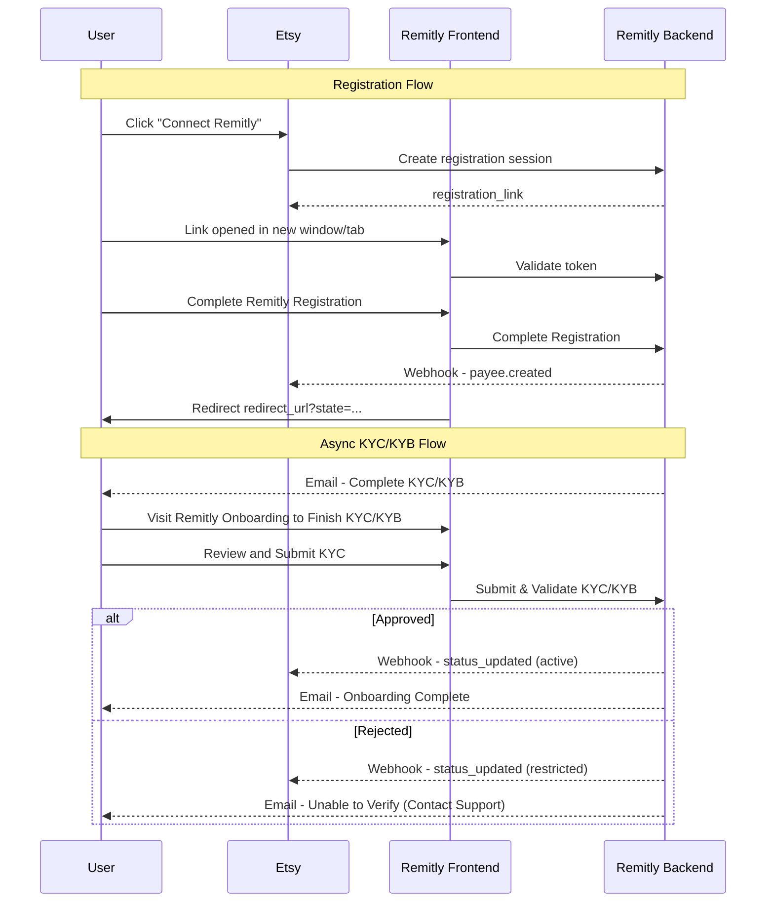

# Payee Registration & Onboarding

## Payee Lifecycle Overview

The Payee lifecycle defines the progression of a Payee from registration initiation through onboarding, compliance review, and payout eligibility.

## 1. Registration Session Created

* A registration session is created via `POST /v1/registration-sessions`.  
* At this stage, a Payee resource does **not** yet exist.  
* A time-limited `registration_link` is returned.  
* No `payee_id` is issued to the partner.

## 2. Onboarding Initiated

* The payee accesses the `registration_link` in a secure tab or browser window launched by the partner.  
* Payee creates or logs into a Remitly account.  
* Remitly onboarding redirects to the provided partner url and the partner closes the window  
* A Payee resource is created upon successful completion of onboarding.  
* A unique `payee_id` is generated.  
* Initial status is set to: `pending`  
* A `payee.created` webhook is fired.

## 3. Compliance Submission (KYC / KYB)

* The payee receives an email from Remitly to complete KYC / KYB  
* The payee reviews partner provided KYC / KYB in Remitly web or native application, and provides any other additional Remitly required information and/or documents 

### Approved

* Upon successful submission, the status transitions to active  
* The payee is eligible to receive funds  
* The payee.status_updated webhook is fired

### Rejected / Restricted

* The status transitions to restricted  
* The payee is ineligible to receive funds  
* The payee.status_updated webhook is fired

## 4. Ongoing Monitoring

Payee status may change due to the following but not limited to:

* Periodic compliance review  
* Sanctions screening updates  
* Regulatory requirements  
* Suspicious activity

Status may transition from:

* `active` → `restricted`  
* `restricted` → `active` (after remediation)

Each status update will result in a `payee.status_updated` webhook being fired

The partner can retrieve a payee at any time via  `GET /v1/payees/{payeeId}`

## Important Behavioral Rules

* A `payee_id` is issued **only after successful onboarding completion**.  
* `404 Not Found` indicates that no Payee resource exists.  
* Status transitions are communicated via webhooks.  
* Partners should treat `active` as the only payout-eligible state.

## API Endpoints

See the [API Reference](/relyplat) for detailed endpoint documentation:

- `POST /v1/registration-sessions` - Create a registration session
- `GET /v1/payees?external_user_id={id}` - Retrieve a payee by External User ID
- `GET /v1/payees/{payeeId}` - Retrieve a payee by Payee ID

## Webhooks

- `payee.created` - Fired when a payee is created
- `payee.status_updated` - Fired when a payee's status changes

See the [Payouts Webhooks](../payouts/webhooks) section for webhook details.

