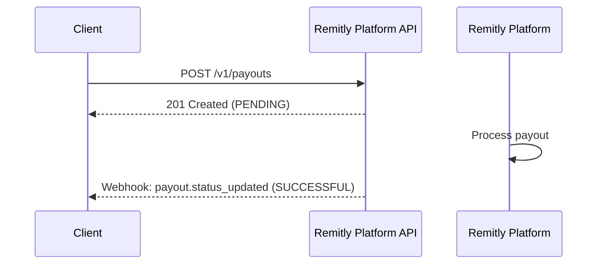
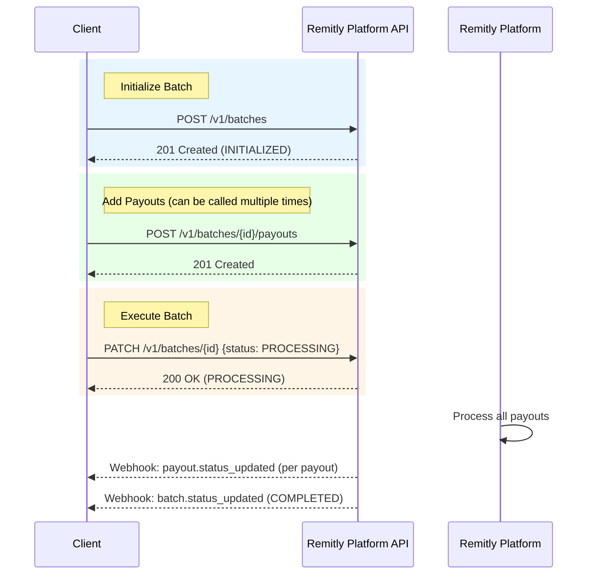
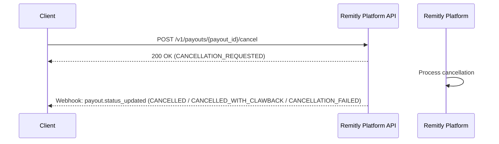

# Payouts

## Payout Lifecycle

### Standalone Payout

### Batch Payouts

## List Payouts

You can retrieve a paginated list of payouts using the `GET /v1/payouts` endpoint with optional filters:

| Parameter | Description |
|-----------|-------------|
| `payee_id` | Filter by payee ID |
| `created_after` | Return payouts created after this timestamp (ISO-8601 UTC) |
| `created_before` | Return payouts created before this timestamp (ISO-8601 UTC) |
| `limit` | Maximum number of results (default: 20, max: 100) |
| `next_cursor` | Pagination cursor from a previous response |

## Cancellations

You can request cancellation of a payout using the `POST /v1/payouts/{payout_id}/cancel` endpoint.

### Key Points

- Cancellation requests are processed asynchronously
- If the payout has not been processed yet, it will be cancelled without any money transfer (`CANCELLED`)
- If the payout was successful, Remitly will attempt to claw back the funds (`CANCELLED_WITH_CLAWBACK` or `CANCELLATION_FAILED`)
- Cancellation requests are not accepted for payouts processed more than 120 days ago
- The `completed_amount` field shows the net amount paid to the payee after any clawbacks

### Cancellation Lifecycle

## API Endpoints

For detailed API endpoint documentation including request/response schemas, parameters, and examples, see the [API Reference](/api):

- **Payouts**: Create, retrieve, list, and cancel individual payouts
- **Batches**: Create, manage, and execute batch payouts (up to 10,000 payouts per batch)
- **Reports**: Generate and download settlement reports

## Next Steps

- See the [API Reference](/api) for detailed endpoint documentation
- Learn about [Webhooks](./webhooks) for real-time status updates
- Review [Status Lifecycle](../reference/status-lifecycle) for state transitions

