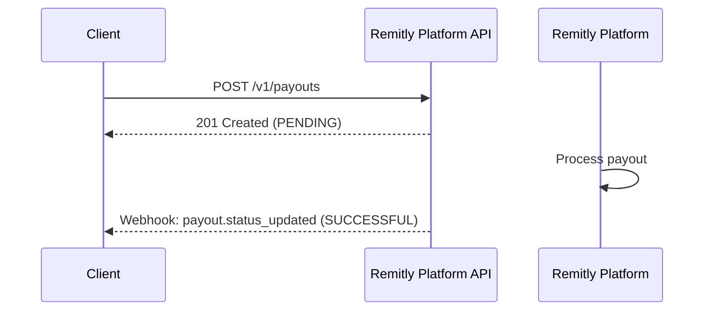
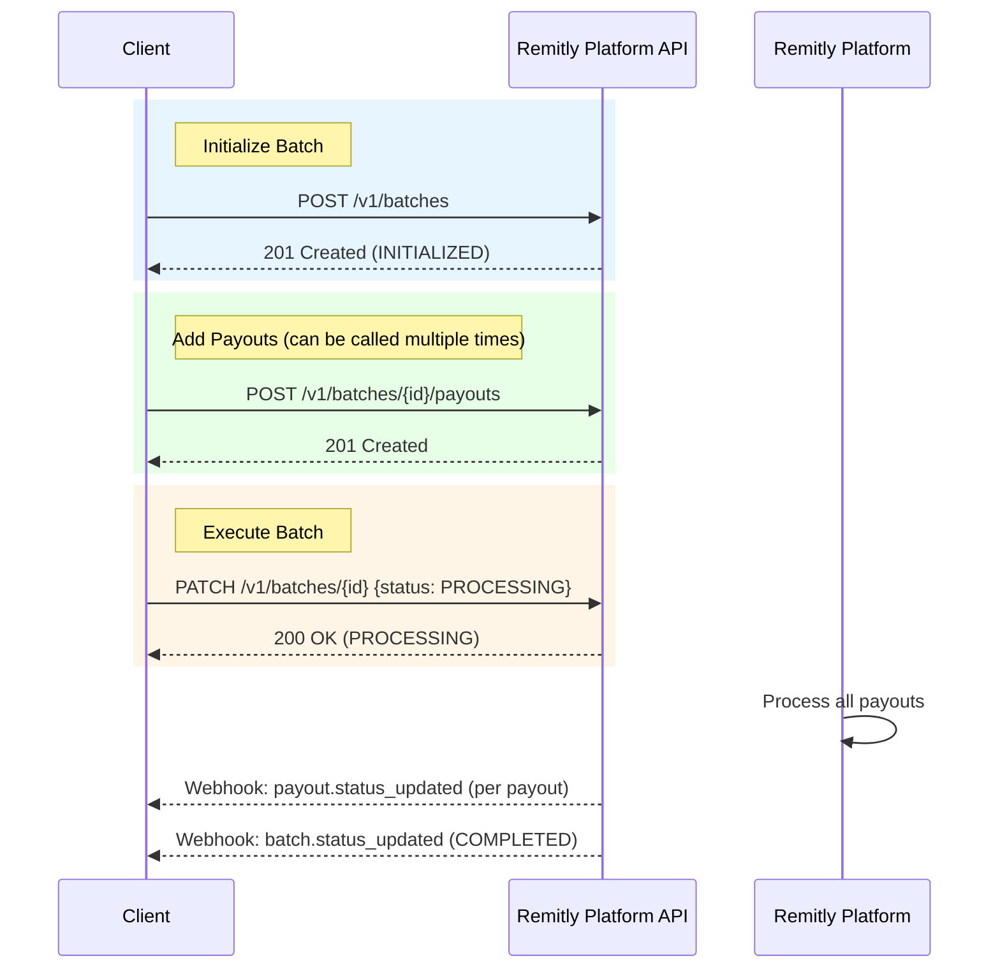
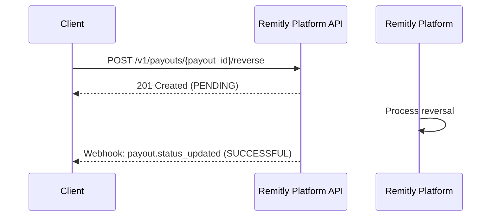

# Payouts

## Payout Lifecycle

### Standalone Payout

### Batch Payouts

## List Payouts

You can retrieve a paginated list of payouts using the `GET /v1/payouts` endpoint with optional filters:

| Parameter | Description |
|-----------|-------------|
| `type` | Filter by payout type: `PAYOUT` or `REVERSAL` |
| `payee_id` | Filter by payee ID |
| `created_after` | Return payouts created after this timestamp (ISO-8601 UTC) |
| `created_before` | Return payouts created before this timestamp (ISO-8601 UTC) |
| `limit` | Maximum number of results (default: 100, max: 1000) |
| `next_cursor` | Pagination cursor from a previous response |

## Reversals

A reversal creates a new payout with a negative amount to reverse a previously successful payout.

### Key Points

- Only payouts with status `SUCCESSFUL` can be reversed
- Only standard payouts can be reversed (reversals cannot be reversed)
- Only one reversal is allowed per payout
- The reversal amount equals the original payout amount (or available amount if less)
- Reversals follow the same lifecycle as standard payouts
- Reversals appear in reports with negative amounts

### Reversal Lifecycle

## API Endpoints

For detailed API endpoint documentation including request/response schemas, parameters, and examples, see the [API Reference](/api):

- **Payouts**: Create, retrieve, list, and reverse individual payouts
- **Batches**: Create, manage, and execute batch payouts (up to 10,000 payouts per batch)
- **Reports**: Generate and download settlement reports

## Next Steps

- See the [API Reference](/api) for detailed endpoint documentation
- Learn about [Webhooks](./webhooks) for real-time status updates
- Review [Status Lifecycle](../reference/status-lifecycle) for state transitions

