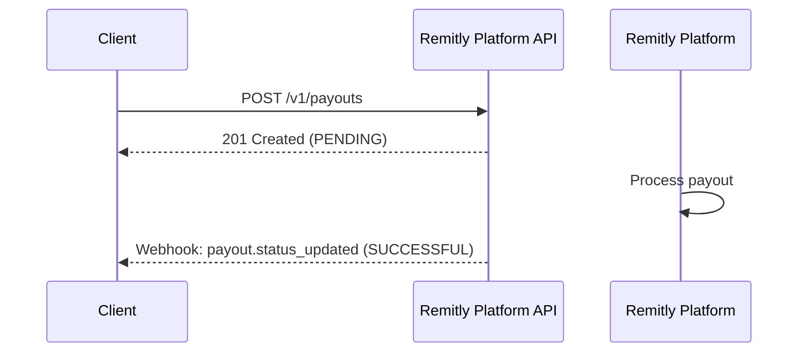
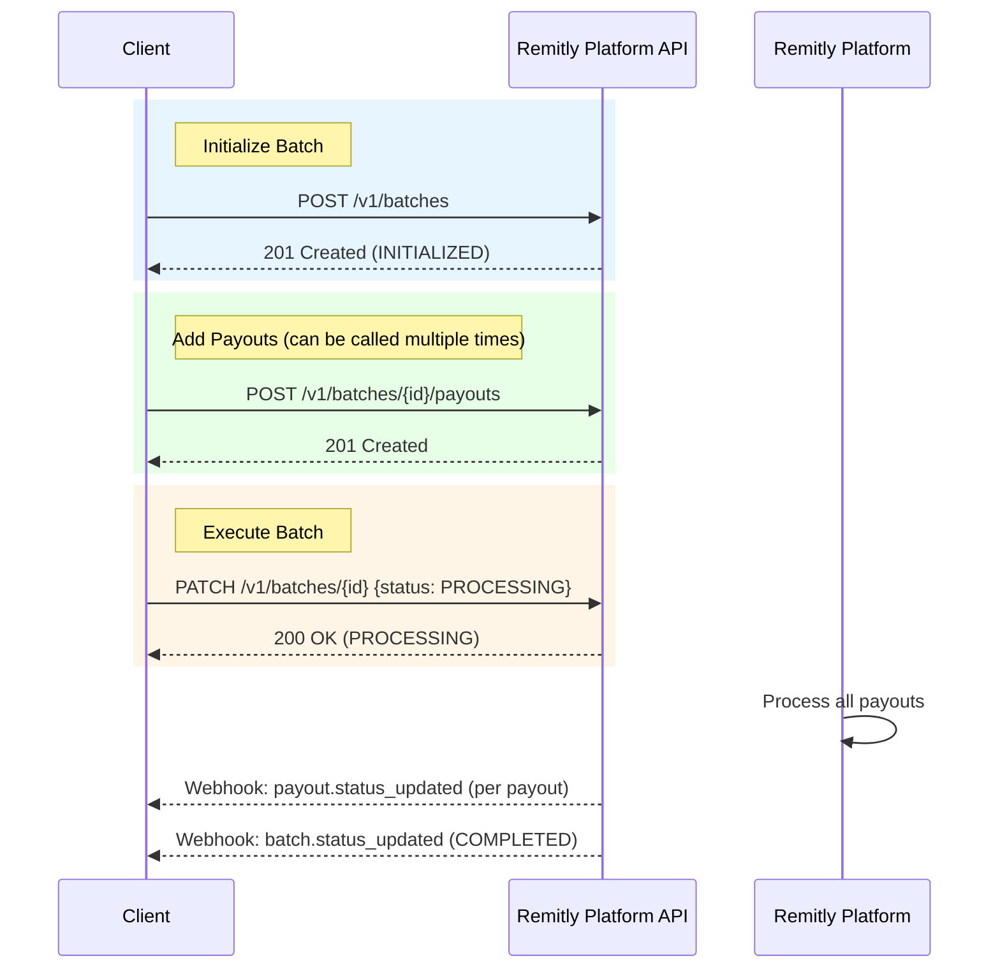

# Payouts

## Payout Lifecycle

### Standalone Payout



### Batch Payouts



## Payout APIs

### Create a payout

```
POST /v1/payouts
```

**Headers**

* **Idempotency-Key** `string` — **REQUIRED**  
  * A unique UUID v4 for the request.

**Attributes**

* **external_payout_id** `string` — **REQUIRED**  
  * Your internal reference ID for this payout.  
* **payee_id** `string` — **REQUIRED**  
  * The Remitly internal ID for the recipient.  
* **amount** `string` — **REQUIRED**  
  * The transfer amount in decimal base currency units (e.g., `"10.00"` = $10.00 USD).  
* **currency** `string` — **REQUIRED**  
  * ISO currency code (must be USD).  
* **metadata** `dictionary` — **OPTIONAL**  
  * Custom key-value pairs (max 10 fields, 255 chars/value).

See the [API Reference](/relyplat) for complete endpoint documentation.

### Get payout details

```
GET /v1/payouts/{payout_id}
```

Retrieves the details of a specific payout by its ID.

## Batch APIs

### Create a batch

```
POST /v1/batches
```

Creates a new batch container for grouping payouts. The batch is created in `INITIALIZED` status.

### Add payouts to a batch

```
POST /v1/batches/{batch_id}/payouts
```

Adds one or more payouts to an existing batch. Maximum of 500 payouts can be added per request. A batch can contain up to 10,000 payouts total.

### Update batch status (Execute/Cancel)

```
PATCH /v1/batches/{batch_id}
```

Updates the status of a batch to execute or cancel it.

**Valid Status Transitions:**

| Target Status | Allowed When Current Status Is | Description |
|:--------------|:-------------------------------|:------------|
| `PROCESSING` | `INITIALIZED` | `Start executing the batch. All payouts will begin processing.` |
| `CANCEL_REQUESTED` | `INITIALIZED` | `Cancel before execution. All payouts will be cancelled.` |
| `CANCEL_REQUESTED` | `PROCESSING` | `Cancel during execution. Best effort to cancel remaining payouts.` |

**Cancellation Behavior:**

- If batch processing has **not yet started** (status is `INITIALIZED`): All payouts in the batch will be cancelled.  
- If batch processing has **already started** (status is `PROCESSING`): Payouts that have already been processed will remain in their current state. We will make a best effort to cancel payouts that have not yet been processed.

### Get batch summary

```
GET /v1/batches/{batch_id}
```

Retrieves the summary information for a specific batch.

### List payouts in a batch

```
GET /v1/batches/{batch_id}/payouts
```

Retrieves a paginated list of payouts within a specific batch. Use cursor-based pagination with `limit` and `next_cursor` parameters.

## Report APIs

Currently, only **settlement** reports are supported.

### Create report

```
POST /v1/reports
```

Trigger a background job to generate a settlement report.

### Check report status

```
GET /v1/reports/{report_id}
```

Poll this endpoint to check if the report is ready for download. When status is `COMPLETED`, use the `download_url` to retrieve the report.

## Next Steps

- See the [API Reference](/relyplat) for detailed endpoint documentation
- Learn about [Webhooks](./webhooks) for real-time status updates
- Review [Status Lifecycle](../reference/status-lifecycle) for state transitions

