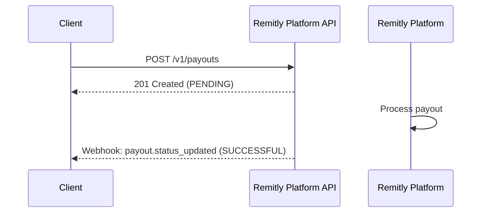
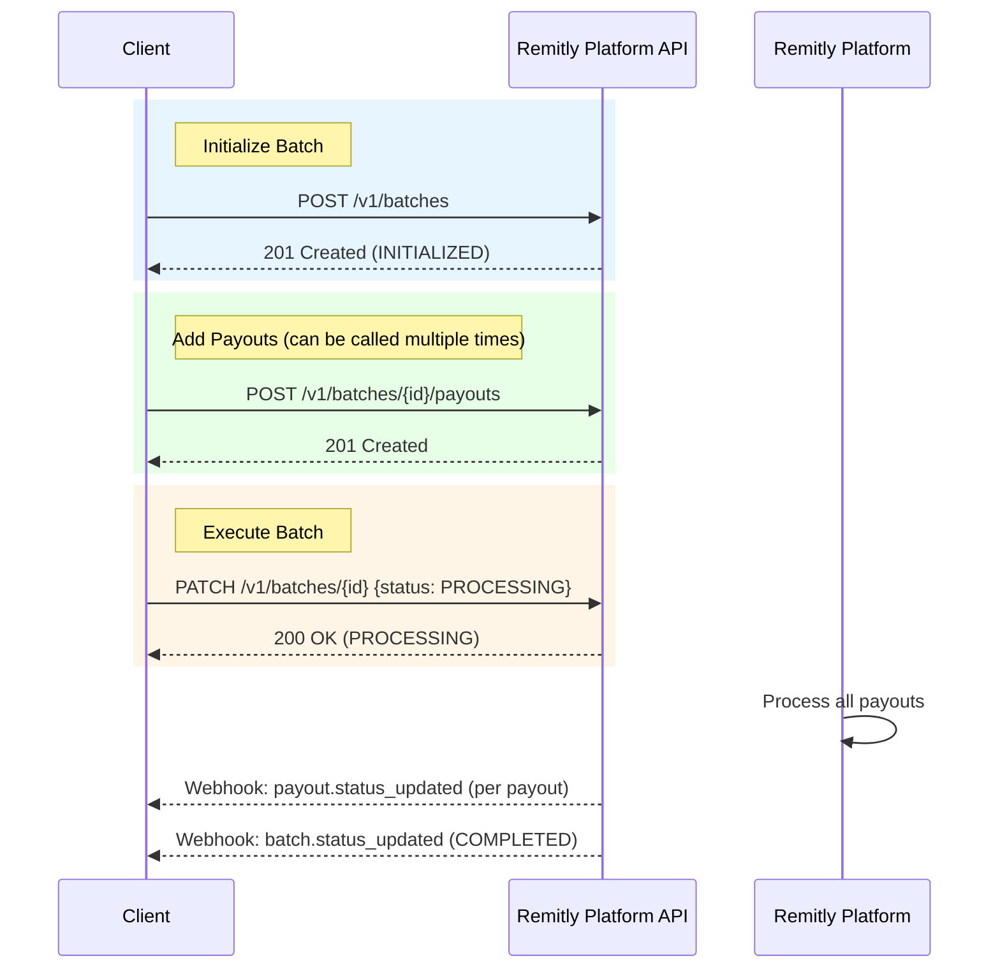

# Payouts

## Payout Lifecycle

### Standalone Payout

### Batch Payouts

## API Endpoints

For detailed API endpoint documentation including request/response schemas, parameters, and examples, see the [API Reference](/relyplat):

- **Payouts**: Create and retrieve individual payouts
- **Batches**: Create, manage, and execute batch payouts (up to 10,000 payouts per batch)
- **Reports**: Generate and download settlement reports

## Next Steps

- See the [API Reference](/relyplat) for detailed endpoint documentation
- Learn about [Webhooks](./webhooks) for real-time status updates
- Review [Status Lifecycle](../reference/status-lifecycle) for state transitions

